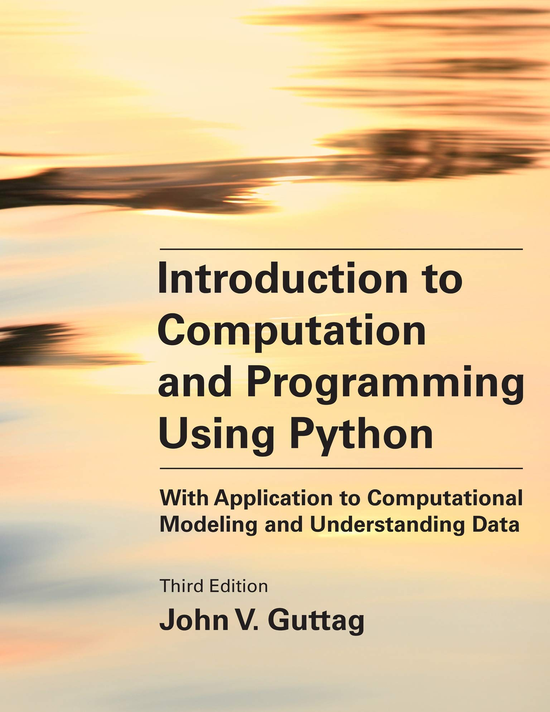

# Introduction to Computation and Programming Using Python

The file [errata](errata.pdf) contains a list of significant known errors in the first and second printings.

The code for each chapter and any files used by the code are in the folder code files. To download all of the code, click on the green button that says [Code]. That will download all of the files (as a zip file).

MIT courses based on an earlier edition of this book can be found at:
- [6.0001 Introduction to Computer Science and Programming](https://ocw.mit.edu/courses/electrical-engineering-and-computer-science/6-0001-introduction-to-computer-science-and-programming-in-python-fall-2016/)
- [6.0002 Introduction to Computational Thinking and Data Science](https://ocw.mit.edu/courses/electrical-engineering-and-computer-science/6-0002-introduction-to-computational-thinking-and-data-science-fall-2016/)

